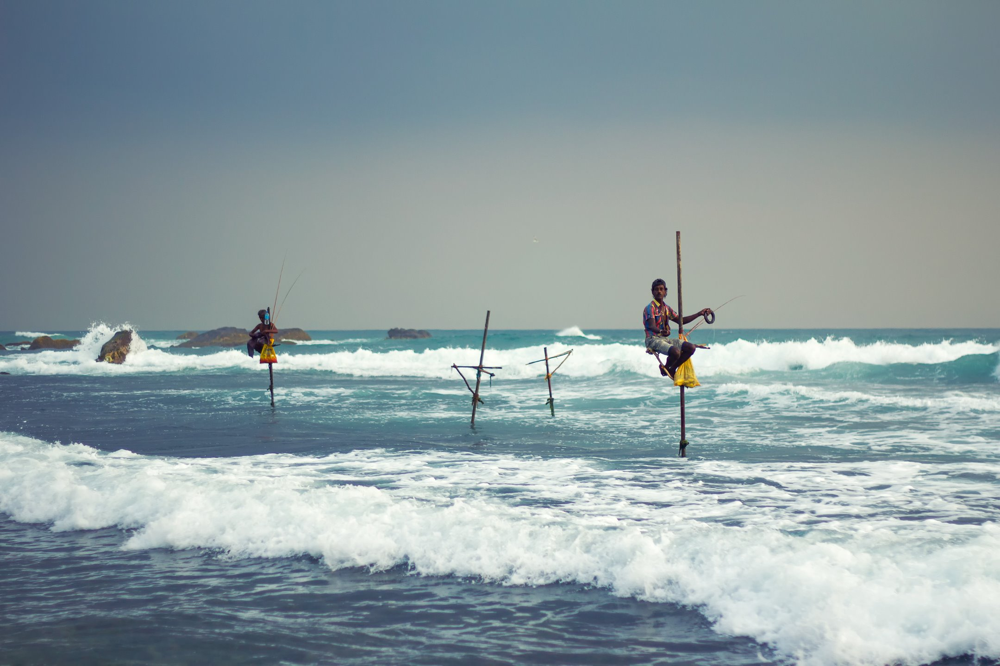
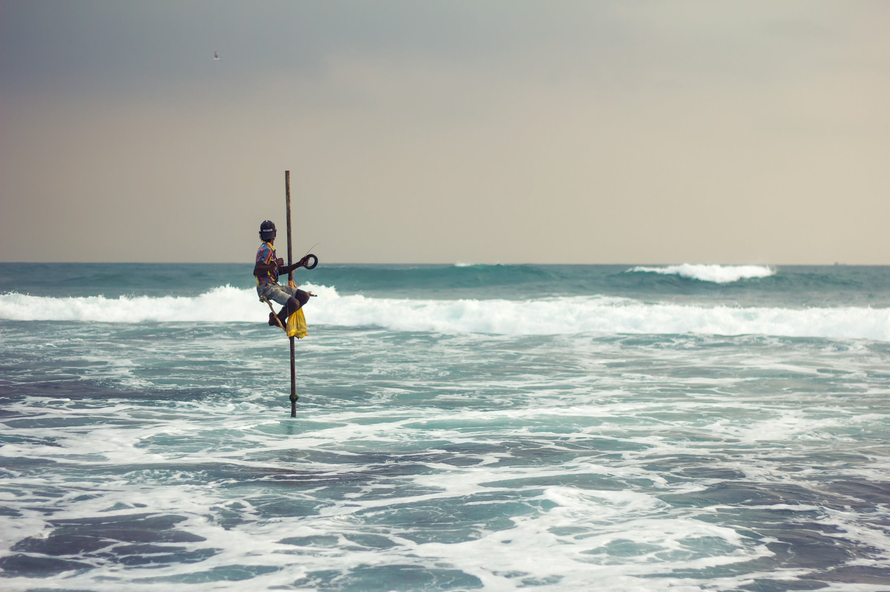
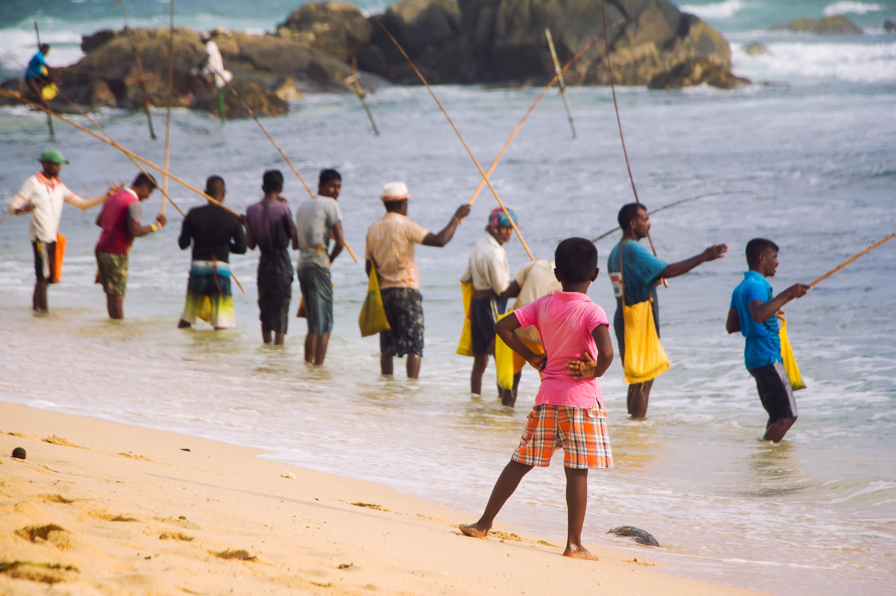
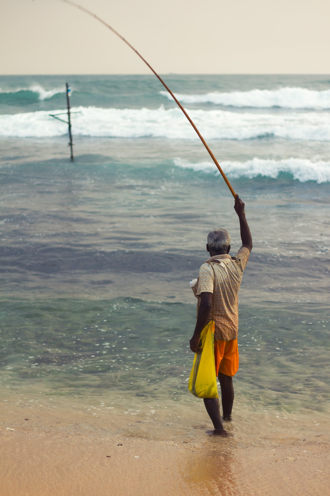

### The Back Story

*More about traveling Sri Lanka by tuktuk [here](/sri-lanka-tuktuk/).*

A friend and I had traveled in Vietnam in 2017 by motorbike and loved the exposure and 
flexibility it provided. We joked that our next trip should be via a vehicle with one more
wheel than a motorbike. That left us with several options:

1. Tricycle
2. Bicycle with one training wheel
3. Motorbike with a side car
4. Tuktuk

After reading a bit about traveling by tuktuk in Sri Lanka, we knew it was the way to go.

We spent several days in the area, hoping to find the now-elusive *authentic* stilt fishermen.
After the world saw Steve McCurry's iconic shots of the wonderful traditional practice, 
and several other reasons, locals posing as fisherman who charge tourists to capture their
smiles make much more than the ones who still practice the craft.

We kept hearing rumors that a group was working their way down the coast. On our last night
in the area, about two hours before sunset, we finally saw them. As enthusiastic photographers,
and culturally-insensitive tourists, we snapped away until it got dark.

*Some seemed to be experts, while others were just getting started.*

*Written on April 27th, 2020*