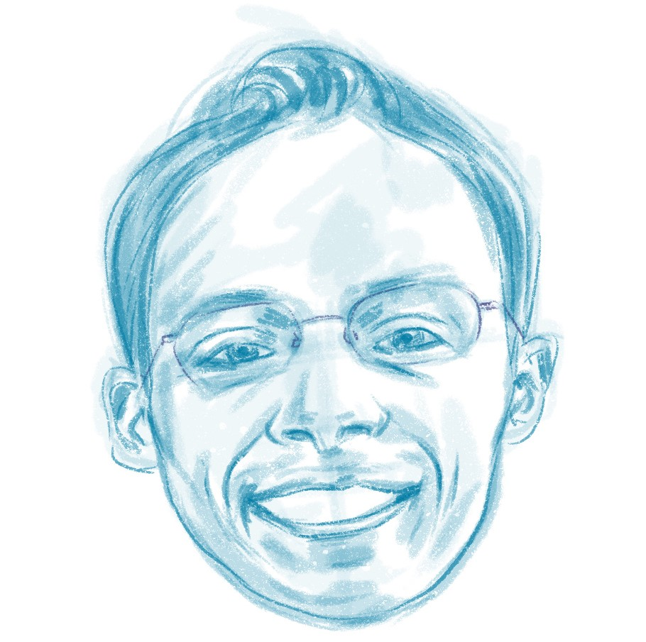

🎓 I grew up in the Pacific Northwest in the United States, and have studied and worked in the US, Thailand, Kenya, Switzerland and China. I'm interested in the intersection of policy, science, management and communication, and taking a more holistic approach towards solving problems within the SDG framework, specifically with issues involving water and sanitation.

📸 My love of photography begun at a young age and became more professional during high school, when I worked as a freelance real estate photographer. During university, I helped lead a college-level hands-on night photography class, which focused on both technical settings and unconventional approaches to creating great photographs. Since then, I have won several photo contests and have become a stock photo contributor to Getty Images. After arriving in China for work and education, I started offering photography tours and workshops, and have volunteered with a local NGO to photograph their mission to improve the education and general welfare of disadvantaged children in China. I'm currently pursuing a master's in public policy in Beijing and Geneva, Switzerland. My current photography interests revolve around street and travel photography.
